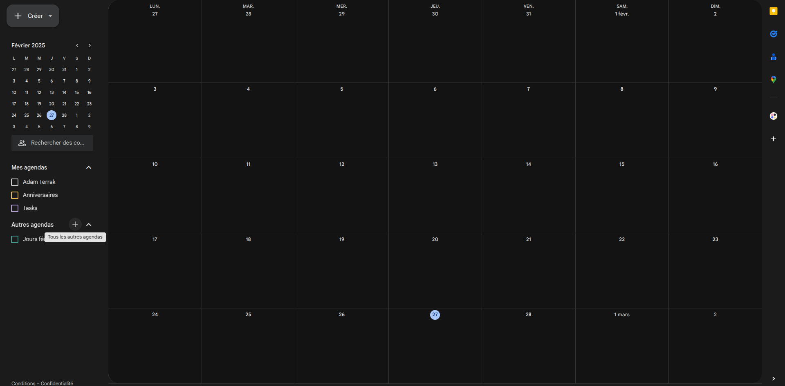
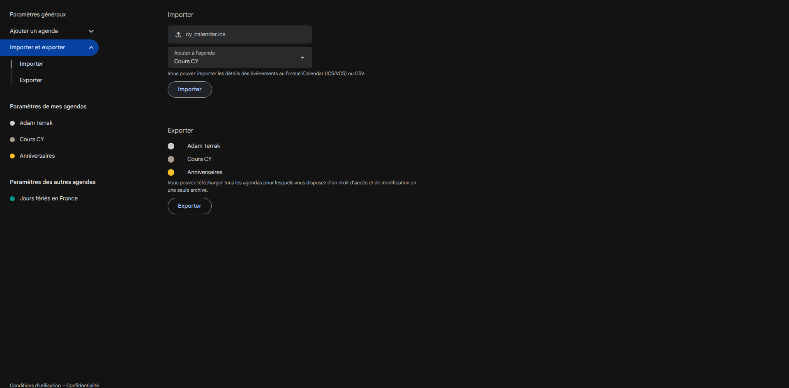
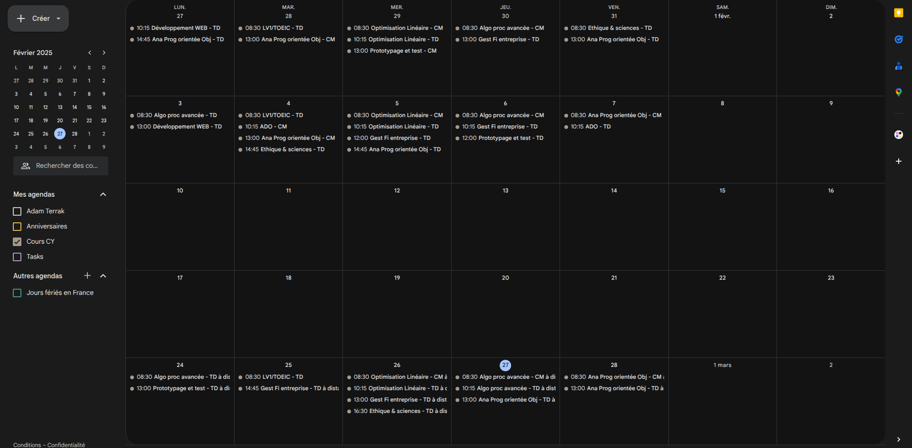
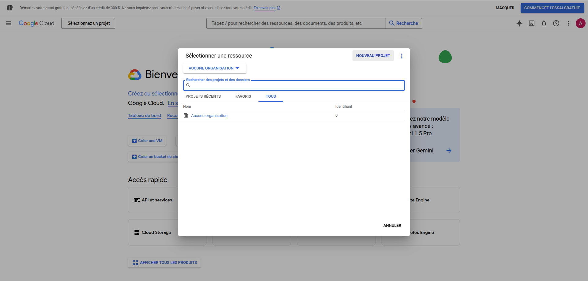
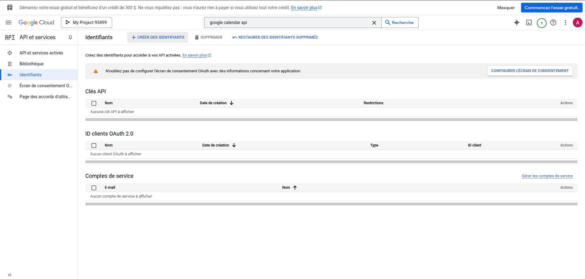
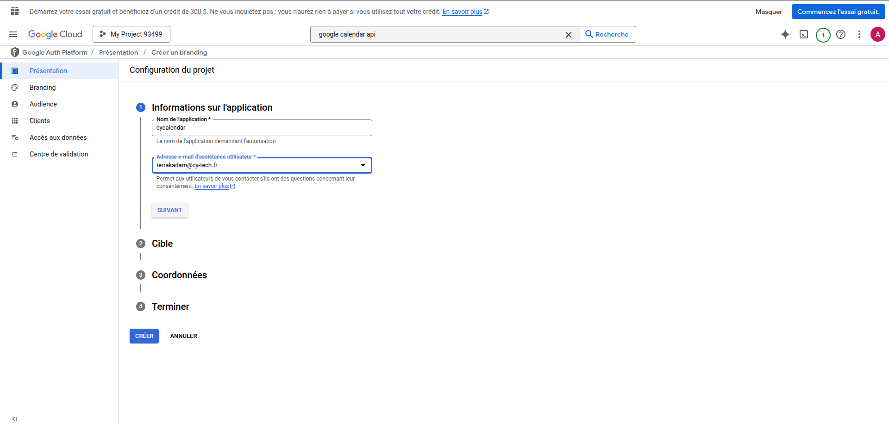
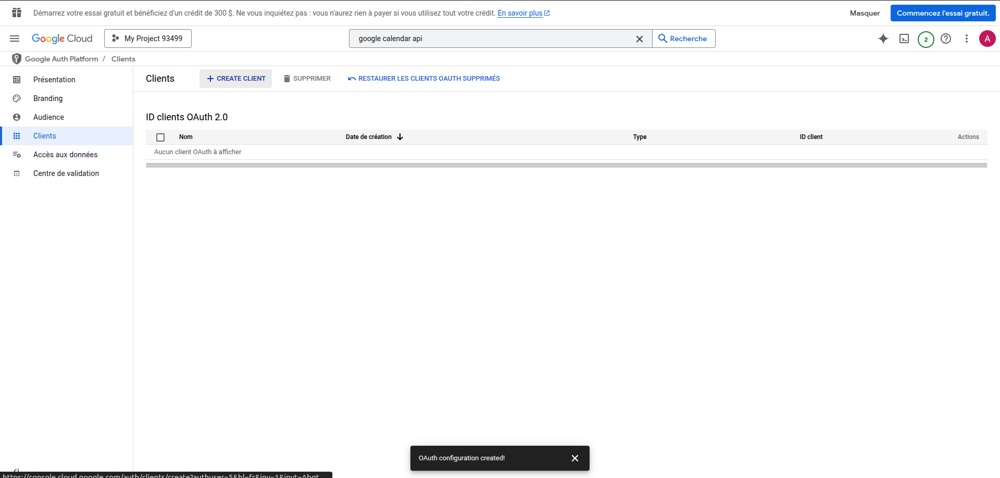
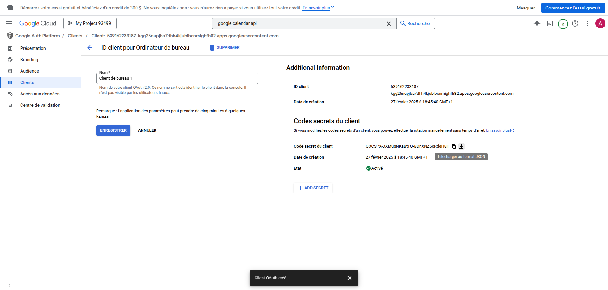
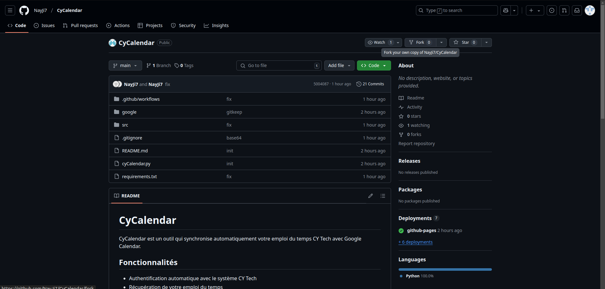
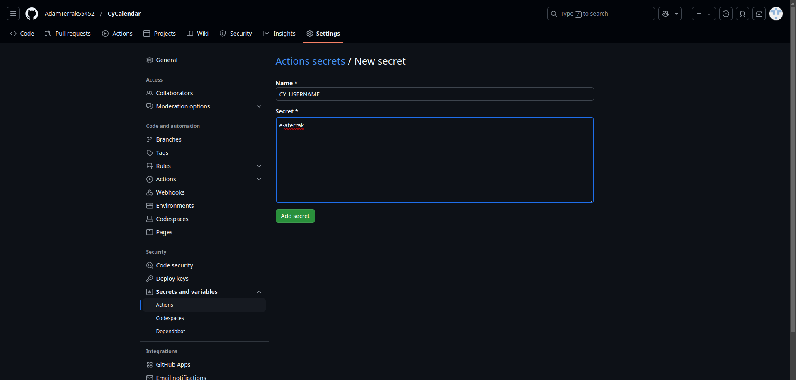

# CyCalendar

CyCalendar est un outil qui synchronise automatiquement ou manuellement votre emploi du temps CY Tech avec Google Calendar. Le choix de google calendar a été fait puisque ce service est connecté avec d'autres applications comme le calendrier d'apple ou encore notion. **CE PROGRAMME NE S'UTILISE QUE SUR UBUNTU** (Etants étudiant à cytech vous devez sûrement y avoir accès quand même...)

## Fonctionnalités

- Authentification automatique avec le système CY Tech
- Récupération de votre emploi du temps
- Conversion au format ICS
- Synchronisation avec Google Calendar
- Coloration automatique : bleu pour les CM, rouge doux pour les TD (Possibilité de modifier les couleurs à voir plus bas)

## Installation et Utilisation

   Ce script peut être utilisé de 3 façons: Génération simple du .ics et import manuel par vos soins ou bien import automatique via l'api de google avec possibilité d'ajout des mises à jour automatiques via github actions.

   Des erreurs sont susceptibles d'arriver et pourtant de ne pas géner l'execution du programme. Vérifiez par vous même le fonctionnement ou non tu programme.

### Utilisation manuelle
   Cette utilisation est de loin la plus simple. Voici ses étapes :
   1. Installer les dépendances ubuntu et python en éxecutant la commande suivante : ``` ./setup.bash # à la racine du projet ```
   2. Créer un fichier nommé '.env' à la racine du projet contenant ces informations : 
   ``` 
   CY_USERNAME=username # e-1erelettreprenom+nom
   CY_PASSWORD=password # votre mot de passe
   ``` 
   3. Executez le script en lançant la commande : ``` python3 cyCalendar.py  ```
   
   Quelques erreurs devraient survenir mais le principal réside dans la génération du .ics. Si à l'étape 2 vous obtenez un message de ce style : 
   ```  
   Fichier ICS créé avec succès: /home/cytech/Desktop/CyCalendar/generated/cy_calendar.ics (257 événements)
   ```
   Alors c'est gagné. Votre fichier .ics se trouve dans le dossier generated/ et vous n'avez plus qu'à aller sur google agenda, selectionner le + pour créer un nouvel agenda. 

   

   Appelez le comme vous le souhaitez (Cours CY par exemple), puis créez le.
   Ensuite Il ne vous restera plus qu'à cliquer sur importer et exporter, choisir votre nouveau calendrier et selectionner le .ics précedemment généré.

   

   Après cela, google agenda va mouliner et retourner un message de validation confirmant le nombre d'éléments importés.

   

   Une fois le chargement fini vous remarquez qu'en revenant en arrière vous avez bien votre nouvel agenda avec vos cours. 

   **CETTE METHODE N'ACTUALISE RIEN.** Ce qui signifie qu'il faudra recommencer à chaque fois que vous voudrez récupérer votre emploi du temps pour cette année. Embettant n'est ce pas ? C'est pourquoi la 2e méthode est bien plus efficace.

### Configuration automatique (Sans Github Actions)

   Passons maintenant à la méthode la plus intéressante mais également la plus complexe. Nous allons configurer le script pour importer automatiquement le .ics dans google agenda en passant via l'api.

   Pour cette methode plus d'étapes et de prérequis sont nécessaires. Alors accrochez vous bien, ça vaut quand même le coup.

   1. Réaliser les étapes 1 et 2 de la méthode précédente afin d'installer les dépendances et d'initialiser les variables d'environnement.
   2. Se rendre sur https://console.cloud.google.com/?hl=fr et vous connecter avec l'adresse mail de votre choix. Une fois sur cette page vous allez cliquer sur Sélectionnez un projet puis Nouveau projet.
   
   

   Renommez le ou laissez tout tel quel qu'importe, puis cliquez sur créer. Patientez le temps que la création se finisse puis ouvrez le en cliquant sur le popup à droite. 
   Une fois sur le tableau de bord, recherchez 'google calendar api' dans la barre de recherche et cliquez sur le 1er résultat.

   

   Cliquez sur Activer et patientez.
   Après cela rendez vous dans le menu à gauche catégorie identifiants puis cliquez sur créer des identifiants.

   

   Choisissez ID client OAuth. Cliquez sur Configurer l'écran de consentement, premiers pas puis mettez le nom et l'adresse que vous souhaitez. 

   

   Choisissez externe, suivant, votre adresse mail encore, suivant, cochez la case, continuer puis créer.
   Par la suite séléctionnez Clients sur la gauche puis create client.

   

   Choisissez application de bureau, et modifiez le nom si vous le souhaitez (aucune importance). Cliquez ensuite sur créer.
   Ensuite cliquez sur le client que vous avez créé puis sous Codes secrets du client cliquez sur l'icone de téléchargement sous format json.

   

   Il ne vous reste plus qu'à déplacer ce fichier .json tel quel dans le dossier google et c'est fini pour cette étape !

   3.  Pour finir, executez le script en lançant la commande : ``` python3 cyCalendar.py  ```. Cette fois ci à l'étape 3 une fenetre d'authentification google s'ouvrira, selectionnez la même adresse que celle utilisée précedemment et voila !
   
   Cette méthode permet donc d'importer vos cours de la meme façon mais en ayant l'avantage de mettre vos cours en couleur. De plus c'est quand même plus pratique de n'avoir qu'à executer un script.

   

### Configuration automatique et périodique
   Cette méthode utilise github actions pour créer une execution périodique du script sur un serveur ubuntu que l'on créera dans les serveurs de github.
   (Github actions est gratuit pour les repos publics et nécessite github pro pour les repos privés)
   Voici les étapes :

   1. Etapes 1 et 2 de la méthode 1
   2. Etapes 1 et 2 de la méthode 2
   3. Il va falloir maintenant fork mon repository car pour créer une github action il vous faut votre propre repo. Pour ce faire allez sur github, connectez vous, rendez vous dans mon repo https://github.com/NayJi7/CyCalendar puis faites un fork.
   
   

   Changez le nom ou pas faites ce que vous voulez puis validez. Ensuite cliquez sur Actions dans le menu du haut puis un message apparaitra. Cliquez sur le gros bouton vert lol.

   

   Une fois ici cliquez sur le workflow Update Google Calendar tout beau tout préconfiguré pour vous waw

   

   Puis cliquez sur enable worklfow.

   Une fois tout ça fait il va falloir aller créer les variables secrètes d'environnement. Cliquez sur les paramètres de votre nouveau repo puis allez sur Secrets and variable et Actions.

   

   Une fois sur cette page cliquez sur le gros bouton vert mdr (New repository secret).

   Il va falloir enregistrer 4 variables :

   - CY_USERNAME avec la valeur de votre username cy 
   - CY_PASSWORD avec votre mot de passe associé à cet username
   - GOOGLE_CREDENTIALS avec le contenu du fichier google/client_secret ... .json qu'on a généré tout à l'heure
   
   
   
   Il en reste une mais pour ça il va falloir executer le petit script situé dans src/ en executant la commande : ``` python3 src/token_converter.py ```
   Vous n'avez plus qu'à copier coller le resultat de votre terminal à une dernière variable qu'il faudra nommer 

   - GOOGLE_TOKEN_PICKLE avec la valeur précemment convertie
    
   TADAAA. C'est fini. Si vous voulez faire un test manuel vous pouvez retourner sur actions, update google calendar à gauche et cliquer sur run workflow.

   

   Actualisez la page, cliquez sur le workflow qui est apparu, cliquez sur update-calendar puis regardez la magie opérer. Patientez un petit moment (c'est long sur les serveurs ubuntu, ça doit tout réinstaller).

## Structure des dossiers

- `.github/workflows` : Configuration pour le workflow github actions
- `generated/` : Stockage des fichiers ICS générés
- `google/` : Stockage des fichiers d'authentification Google (credentials et token)
- `image/` : Stockage des images utilisées dans le README
- `src/` : Code source du projet

## Suppléments

Eh bien, quelle curiosité, t'as scrollé jusqu'ici quand même. Ici on arrive sur les parametrages un peu plus spéciaux (on va rentrer dans le code source).

- Changement de l'intervalle de récupération des cours
   Année, mois ou semaine
   ``` 
   calendar_converter.py -> ligne 26
   def get_calendar_data(cookie, student_number,    range='year | month | week'):
   ```
   Récupère les cours de l'année (septembre à juillet), le mois (Du 1 au 31) ou la semaine (lundi à dimanche).
   
- Changement des couleurs
  Liste des couleurs dispo sous forme de dictionnaire python et de photos (src/google_colors.py et google/google_..._colors.png)

  Couleur de l'agenda Cours CY
  ```
   google_calendar -> ligne 102

        calendar_list_entry['colorId'] = calendar_colors['Cobalt | autre couleur de la liste des calendar colors']
  ```

  Couleur des cours (evenements)
  ```
   google_calendar -> ligne 138

   if any(term in summary.lower() for term in ['examen', 'rattrapages']):
        return event_colors['Sage'] # Vert
    elif 'CM' in summary:
        return event_colors['Peacock'] # Bleu
    elif 'TD' in summary:
        return event_colors['Tomato'] # Rouge
    elif 'TP' in summary:
        return event_colors['Tangerine'] # Orange
    return event_colors['Graphite']  # Couleur par défaut
  ```

## Auteur et informations

- Projet créé par Adam Terrak pour les étudiants de CyTech - ([@NayJi7](https://github.com/NayJi7))
- Contact: e.aterrak@gmail.com